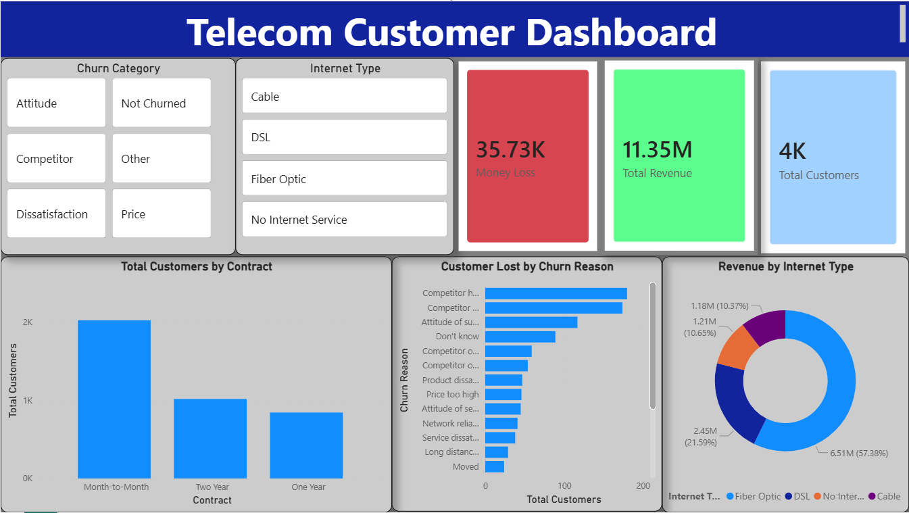

📊 Telecom Customer Churn Analysis & Executive Dashboard

📌 Project Overview
This project provides an end-to-end data analysis of customer churn in a telecommunications company. The main objective is to understand the core reasons behind customer attrition, identify the most vulnerable customer segments, and calculate the exact financial impact (revenue loss) caused by churn.

The final output is an interactive Power BI dashboard designed for C-level executives to track KPIs and make data-driven retention strategies.

🛠️ Tech Stack & Tools
Data Visualization & BI: Power BI

Data Transformation (ETL): Power Query

Calculations: DAX (Data Analysis Expressions)

Data Source: Raw CSV Files

🧹 ETL Process & Data Cleaning
Before visualizing the data, a rigorous data cleaning and transformation process was executed:

Data Integration: Successfully consolidated and modeled data across 3 separate CSV files.

Handling Missing Values: Cleaned and imputed missing/null values, particularly in challenging columns like Avg Monthly Long Distance Charges and Premium Tech Support to ensure calculation accuracy.

Data Type Standardization: Ensured all numerical, categorical, and geographical data types were correctly formatted for optimal model performance.

🗂️ Data Modeling
Established robust 1-to-Many (1-*) relationships between the central fact tables and dimension tables to create a scalable data model.

Optimized the model to handle dynamic filtering and cross-filtering across all visual elements seamlessly.

💡 Key Business Insights
Based on the dashboard analysis, several critical insights were discovered:

The Financial Bleed: The company is currently experiencing a massive $35.73K Monthly Revenue Loss specifically due to churned customers.

The "Flight Risk" Segment: Customers on Month-to-Month contracts are churning at a significantly higher rate compared to 1-Year or 2-Year contract holders.

The Fiber Optic Trap: Interestingly, despite typically being a premium service, Fiber Optic users represent the largest chunk of the churned revenue, suggesting a potential issue with service quality or pricing in that specific segment.

Competitor Impact: A major portion of the customer base is being lost directly to competitors, highlighting the need for immediate counter-offers and retention campaigns.

📸 Dashboard Preview

